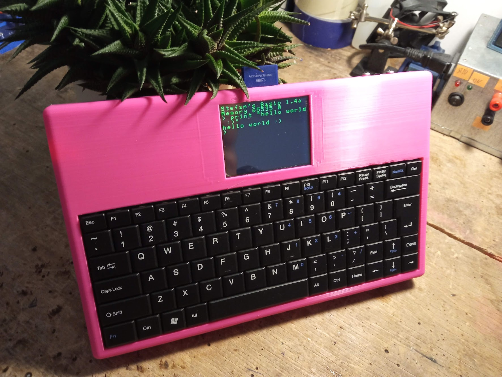
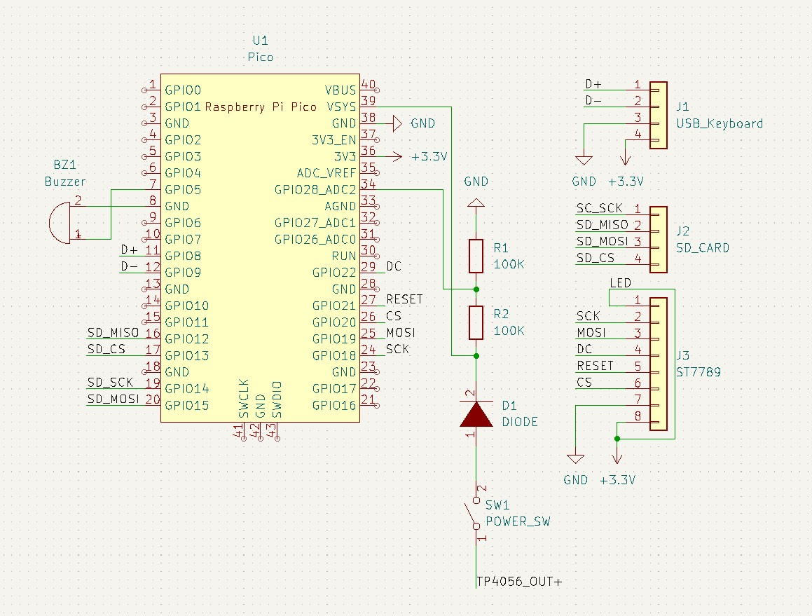
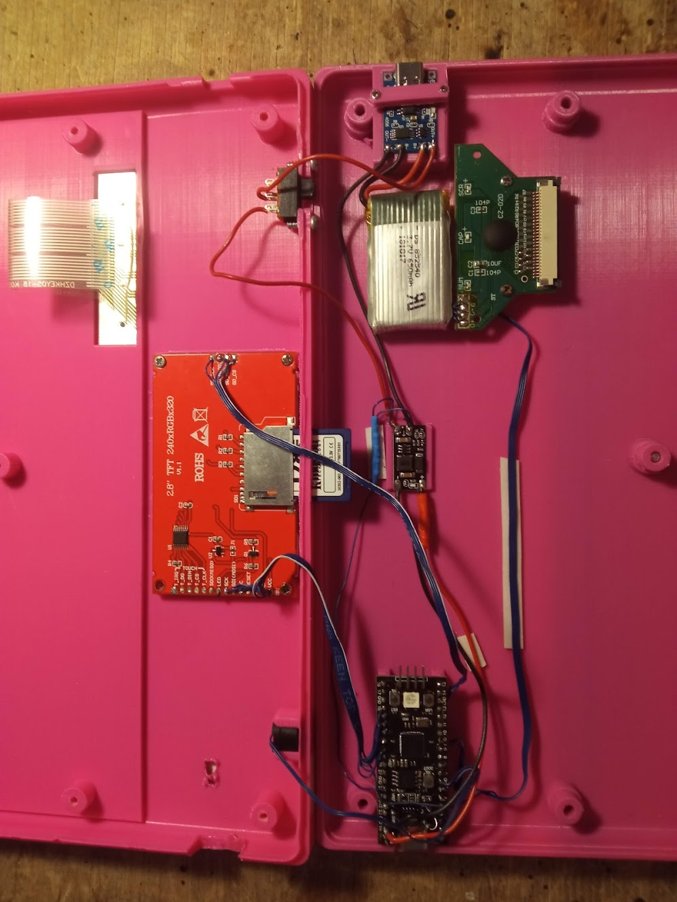

# microcomputer
80s inspired, Pi Pico powered, portable microcomputer that runs BASIC.

# Hardware

The case is 3D printed in two parts, with total dimensions of 255x160x26mm.
Unfortunately this is too big to print laying flat on a Ender 3, but with some extra supports you can print it vertically without any issue.
The files to print are available in the `stl` folder.

This microcomputer uses [Pico-PIO-USB](https://github.com/sekigon-gonnoc/Pico-PIO-USB) to add a second HOST USB port that the keyboard is connected to internally.
## Parts list
- Pi Pico or clone
- 2.8" 320x240 TFT display module with ST7789 driver
- USB keyboard taken out of a universal 10" tablet case (look for "universal usb keyboard 10" tablet case on eBay")
- 1S LiPo battery
- TP4056 battery charger/protection module
- If your Pi Pico clone doesn't have a buck-boost IC you may need to use a external DC-DC boost module to boost the battery voltage to 5V
- 2x 100k resistor for a voltage divider used to measure the battery voltage.
- PC Buzzer for audio output.
- 1x 1A diode.
- Standard size slide power switch
- Some wire to connect the parts together
- Some screws for the case, display and charger module holder

## Schematic
KiCad project used to generate this schematic is available in the `schematic` folder.

## Assembly
Assembly is straight forward, just place the components in their designated spots, and connect them according to the schematic.

### Reference image

# Software

I used the [TinyBasic](https://github.com/slviajero/tinybasic) BASIC interpreter and OS.
I added some extra features and made some hardware specific changes to it.

## Changes compared with upstream TinyBasic
- Added BAT command to measure battery voltage
- Added FONTP command to increase font size
- Added FONTM command to decrease font size
- Added ST7789 display driver
- Added USB keyboard support using the TinyUSB stack
- Made SD card code use the SPI1 of Pi Pico

You can find my version of TinyBasic [here](https://github.com/stopnoanime/tinybasic). 
To compile, go to the TinybasicArduino folder and open the .ino file.
Compile it and upload it to the pico as you would with any other Arduino project

### Important: This project port requires the [earlephilhower](https://github.com/earlephilhower/arduino-pico) Arduino Pi Pico board library, not the Arduino Mbed Core one.